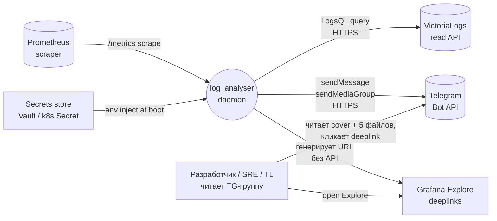
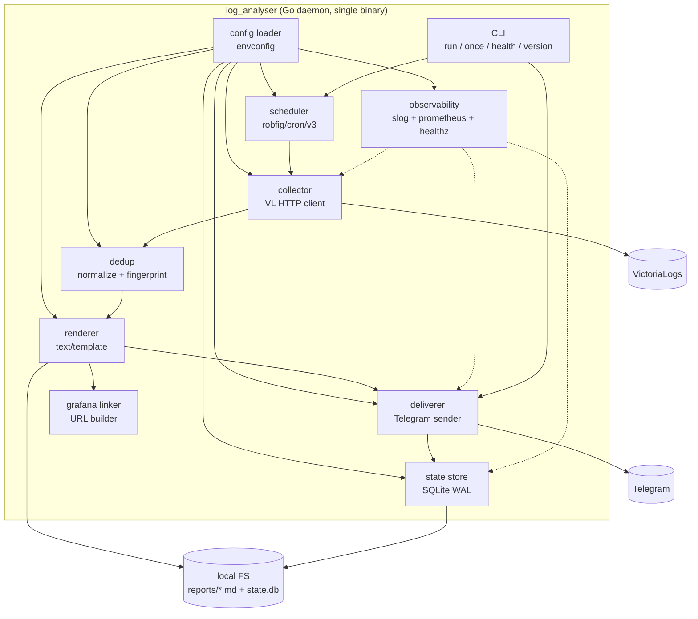
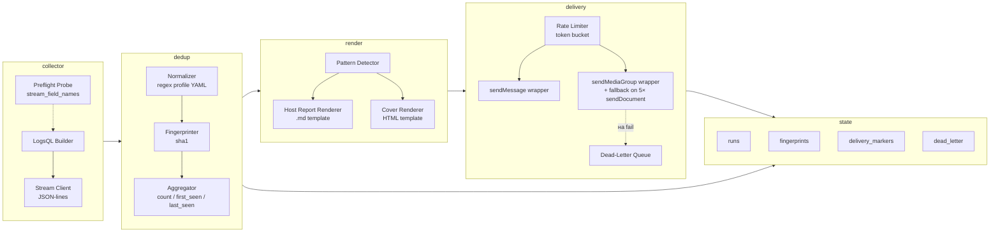

# 10. Архитектура `log_analyser`

> **Роль автора:** Senior Software Architect.
> **Дата:** 2026-04-23. **Версия:** 0.1 (post-analysis).
> **Статус:** DRAFT → готов к peer-review.
> **Вход:** `docs/plans/00-analysis.md` (FR-1..FR-19, NFR, риски R-1..R-12, §13.1 — 12 архитектурных развилок).
> **Выход:** ADR-0002..ADR-0013 в `docs/adr/` + данный документ.

---

## Оглавление

1. [Цели архитектуры и границы ответственности](#1-цели-архитектуры-и-границы-ответственности)
2. [C4 — уровни 1-3](#2-c4--уровни-1-3)
3. [Конвейер digest cycle](#3-конвейер-digest-cycle)
4. [Data model (state DB) и миграции](#4-data-model-state-db-и-миграции)
5. [Контракты модулей (Go-интерфейсы)](#5-контракты-модулей-go-интерфейсы)
6. [Error handling policy](#6-error-handling-policy)
7. [Concurrency model и graceful shutdown](#7-concurrency-model-и-graceful-shutdown)
8. [Extensibility — как что-то добавить](#8-extensibility)
9. [UI-архитектура (v0.3, эскиз)](#9-ui-архитектура-v03)
10. [Прокси-архитектура (v0.2)](#10-прокси-архитектура-v02)
11. [Решения, вынесенные в ADR](#11-решения-вынесенные-в-adr)
12. [Несогласия с рекомендациями аналитика](#12-несогласия-с-рекомендациями-аналитика)
13. [Context7 — библиографический свод](#13-context7--библиографический-свод)

---

## 1. Цели архитектуры и границы ответственности

### 1.1. Цели

- **Надёжность > перформанса.** Daemon — утилитарный, не hot-path. 10 минут на цикл — приемлемо, но пропуск окна — нет.
- **Zero-CGO deploy.** Контейнер собираем `FROM scratch` / `distroless/static`; весь стек — pure-Go. Это требование к выбору SQLite-драйвера (см. [ADR-0002](../adr/0002-state-store-sqlite-wal.md)).
- **Минимум зависимостей.** Каждая внешняя библиотека — обоснование в ADR, проверка через Context7. Прямолинейная реализация на stdlib — предпочтительна.
- **Идемпотентность.** Любой digest cycle можно безопасно перезапустить; дубль в TG — S1 баг.
- **Изоляция доменов.** 5 хостов обрабатываются параллельно; сбой одного не останавливает остальные.

### 1.2. Явно вне архитектуры

- ML-классификация, UI v0.3 — отдельные версии (архитектурный эскиз — §9, детали — позже).
- Распределённый mode / HA. В MVP — single-instance (file lock на state.db, см. [NFR-I2]).
- Универсальный log-source (Loki/ELK) — источник только VictoriaLogs.

### 1.3. Границы системы

| Внешняя система | Протокол | Роль | SLA |
|---|---|---|---|
| VictoriaLogs | HTTPS (GET/POST `/select/logsql/*`) | read-only | зависит от VL ops, см. R-1, R-11 |
| Telegram Bot API | HTTPS (`api.telegram.org`) | write-only | ≥ 99.9% сам TG; для нас — rate limit (R-2) |
| Grafana | URL-генерация (нет API-вызовов) | passive | URL-стабильность — R-5 |
| Prometheus scraper | HTTPS (`/metrics`) | pull from us | внешняя, ≥ 99.0% |
| Secrets store (Vault / k8s Secret / .env) | env injection | read on start | требуется OQ-11 |

---

## 2. C4 — уровни 1-3

### 2.1. C4 Level 1 — System Context



### 2.2. C4 Level 2 — Containers

В MVP — **один** контейнер. UI v0.3 вынесет отдельно (см. §9).



### 2.3. C4 Level 3 — Components (ключевые)



---

## 3. Конвейер digest cycle

`Digest cycle` — единица работы daemon'а (один запуск по cron). Вход: `window = [now-24h, now)` в UTC. Выход: 1 cover + 5 файлов, доставленных в TG.

Полный конвейер: **collect → normalize → dedup → group/pattern → render → deliver → persist**. Каждый шаг изолирован, имеет чёткий контракт и свою метрику.

### Шаг 1. Collect

**Вход:** `(window, host, levels, vl_url)`. Одна goroutine на host.
**Выход:** поток `Event{host, app, level, time, msg, raw}` в канале (buffered, 1024).
**Действие:** построить LogsQL:
```logsql
{host="t5"} _time:[2026-04-22T05:00:00Z, 2026-04-23T05:00:00Z)
  AND (level:=error OR level:=critical)
```
POST `/select/logsql/query`, стрим JSON-lines. Парсим построчно (`encoding/json.Decoder`), ограничиваем память.
**Граничные условия:**
- **Пустой ответ** — не ошибка, продолжаем с пустым списком; в отчёт пойдёт «За окно ошибок не обнаружено».
- **5xx или connection error** — exponential retry (1s, 2s, 4s, 8s, 16s, cap 60s, total cap 15 мин). После исчерпания — `ErrCollectFailed` (permanent для этого хоста, остальные хосты продолжают).
- **Объём > memory budget** — stream, не load-all; жёсткий лимит 500k событий на хост после retrieval (R-11), дальше усечение + пометка.
- **`level` не в стриме** — preflight вернул warning, fallback на обычный фильтр `level:=...`.

### Шаг 2. Normalize

**Вход:** `Event`. **Выход:** `(Event, normalizedMsg, tokens)`.
**Действие:** последовательно применить regex-профиль из `configs/normalize.yaml`:
```yaml
patterns:
  - name: iso_timestamp
    regex: '\d{4}-\d{2}-\d{2}T\d{2}:\d{2}:\d{2}(?:\.\d+)?(?:Z|[+-]\d{2}:?\d{2})'
    replace: '<ts>'
  - name: uuid
    regex: '[0-9a-f]{8}-[0-9a-f]{4}-[0-9a-f]{4}-[0-9a-f]{4}-[0-9a-f]{12}'
    replace: '<uuid>'
  - name: ipv4
    regex: '\b(?:\d{1,3}\.){3}\d{1,3}(?::\d+)?\b'
    replace: '<ip>'
  - name: hex_token
    regex: '\b[0-9a-f]{8,}\b'
    replace: '<hex>'
  - name: trade_id
    regex: '(?i)(trade|order|deal)[ _#-]?\d+'
    replace: '$1_<id>'
  - name: numeric
    regex: '\b\d{2,}\b'
    replace: '<n>'
```
**Граничные условия:**
- Порядок паттернов **важен** (UUID до hex, ISO timestamp до numeric). Тесты обязательны.
- Пустой `normalized` после прогона → fingerprint считается от raw msg + `app`; помечается `normalize:empty`.

### Шаг 3. Dedup (fingerprint)

**Вход:** `(Event, normalized)`. **Выход:** `Incident{fingerprint, host, app, count, first_seen, last_seen, samples[]}`.
**Действие:** `fp = sha1(host + "\x00" + app + "\x00" + normalized)` → hex. Агрегируем in-memory (map per host). `samples` — первые 2 `raw msg` с временем.
**Граничные условия:**
- Коллизии sha1 считаем игнорируемыми (N < 10⁶ event/run, вероятность коллизии пренебрежимо мала).
- false-merge/false-split — R-4, митигация ретроспективой. Профиль нормализации перезагружается на старте, в runtime не меняется.

### Шаг 4. Group / Pattern detection

**Вход:** `[]Incident` по всем хостам. **Выход:** `[]Pattern` + обогащённые инциденты с `isPattern bool`, `crossHosts []string`.
**Действие:**
- **Group by app** — для таблиц в отчёте.
- **Pattern:** инцидент, у которого `count >= pattern_threshold` (default: 10) ИЛИ тот же fingerprint встретился на ≥ 2 хостах (cross-host pattern).
- **Noise:** инциденты с `count < NOISE_K` (default 3) выносятся в отдельный блок «прочее».

### Шаг 5. Render

**Вход:** `HostDigest{host, window, incidents, patterns, noise}`. **Выход:** `io.Reader` + `filename`.
**Действие:** `text/template` с подготовленным `FuncMap` (safe-HTML для TG, safe-URL для Grafana). Шаблоны — в `internal/render/templates/*.tmpl`, **не inline**.
**Граничные условия:**
- Сбой шаблонизатора на одном хосте — отчёт по нему заменяется на заглушку `[render-failed host=t5]`, остальные 4 рендерятся. `NFR-R4`.
- Размер файла > 50 МБ — truncation до 45 МБ + marker `[файл усечён, см. Grafana]` (R-3). Gzip — опция в v0.2.

### Шаг 6. Deliver

**Вход:** `DeliveryUnit{cover, attachments[5]}`. **Выход:** `DeliveryReceipt{cover_message_id, file_message_ids[]}`.
**Порядок:**
1. `BEGIN`/write `delivery_markers(run_id, phase='pre_cover')` — pre-commit state.
2. `sendMessage(cover)` → получить `message_id` → upsert marker.
3. `sendMediaGroup(5 × InputMediaDocument, attach://<name>)` — multipart upload.
4. Update marker `phase='done'`, commit.
5. При ошибке на шаге 2 или 3 — retry с backoff; при исчерпании — в `dead_letter(payload, retries=0)`, алерт `[delivery-failed]`.

**Граничные условия:**
- `sendMediaGroup` возвращает 5 `Message` → все `message_id` пишем в state для возможного отзыва.
- 429 Too Many Requests с `retry_after` — уважаем `retry_after`, **не** экспоненциальный backoff для этого кейса.
- Перезапуск между шагами 2 и 3 → marker показывает `phase=pre_media_group`; при старте daemon читаем marker и **не** шлём cover повторно — сразу media group (R-7).

### Шаг 7. Persist

**Вход:** `DeliveryReceipt + Incidents + Patterns`.
**Действие:** transaction'ом:
- `runs` update `status='ok'`, `finished_at=now()`, `tg_cover_message_id=...`.
- `fingerprints` upsert `(fp, host, app, first_seen, last_seen, count_7d)`.
- `delivery_markers` — мягкое удаление после успеха (или keep для идемпотентности, retention 30 дней).
- Local FS: файлы сохранены до retention (FR-18).

---

## 4. Data model (state DB) и миграции

Выбран **SQLite + WAL** (см. [ADR-0002](../adr/0002-state-store-sqlite-wal.md)), драйвер `modernc.org/sqlite` (pure Go, CGO-free).

### 4.1. Схема

```sql
-- runs: каждый digest cycle = одна строка.
CREATE TABLE runs (
    run_id         TEXT PRIMARY KEY,                      -- ULID
    window_from    INTEGER NOT NULL,                      -- unix seconds UTC
    window_to      INTEGER NOT NULL,
    started_at     INTEGER NOT NULL,
    finished_at    INTEGER,
    status         TEXT NOT NULL CHECK (status IN ('running','ok','failed','partial')),
    tg_cover_msg_id INTEGER,                              -- для возможного edit/delete
    error          TEXT,                                  -- последняя ошибка, если failed
    hosts_ok       TEXT,                                  -- csv хостов, отрендеренных OK
    hosts_failed   TEXT                                   -- csv хостов с render/deliver fail
);
CREATE INDEX idx_runs_window ON runs(window_from, window_to);
CREATE INDEX idx_runs_status ON runs(status, started_at);

-- fingerprints: 7-14-30-90 дневная история для pattern detection.
CREATE TABLE fingerprints (
    fp             TEXT NOT NULL,                         -- sha1 hex
    host           TEXT NOT NULL,
    app            TEXT NOT NULL,
    first_seen     INTEGER NOT NULL,
    last_seen      INTEGER NOT NULL,
    count_total    INTEGER NOT NULL DEFAULT 0,
    count_last_24h INTEGER NOT NULL DEFAULT 0,
    sample_msg     TEXT NOT NULL,                         -- один пример для рендера
    updated_at     INTEGER NOT NULL,
    PRIMARY KEY (fp, host)
);
CREATE INDEX idx_fp_last_seen ON fingerprints(last_seen);
CREATE INDEX idx_fp_host_app  ON fingerprints(host, app);

-- delivery_markers: pre-commit для идемпотентности доставки.
CREATE TABLE delivery_markers (
    run_id         TEXT PRIMARY KEY REFERENCES runs(run_id),
    phase          TEXT NOT NULL CHECK (phase IN ('pre_cover','pre_media_group','done')),
    tg_cover_msg_id INTEGER,
    tg_media_msg_ids TEXT,                                -- csv
    updated_at     INTEGER NOT NULL
);

-- dead_letter: доставка не удалась, ждём ретрая.
CREATE TABLE dead_letter (
    id             INTEGER PRIMARY KEY AUTOINCREMENT,
    run_id         TEXT NOT NULL,
    payload_path   TEXT NOT NULL,                         -- путь к сохранённому cover + files на FS
    created_at     INTEGER NOT NULL,
    retries        INTEGER NOT NULL DEFAULT 0,
    last_error     TEXT,
    next_retry_at  INTEGER NOT NULL
);
CREATE INDEX idx_dlq_next_retry ON dead_letter(next_retry_at) WHERE retries < 10;

-- schema_version: trivial migration tracker.
CREATE TABLE schema_version (
    version        INTEGER PRIMARY KEY,
    applied_at     INTEGER NOT NULL
);
INSERT INTO schema_version(version, applied_at) VALUES (1, strftime('%s','now'));
```

### 4.2. Миграции

Решение: **самописный мини-мигратор** в `internal/state/migrations/`. Обоснование:
- Миграций будет мало (≤ 10 за год), полноценный `golang-migrate` — overkill.
- Pure-Go, без внешних зависимостей — консистентно с [ADR-0002](../adr/0002-state-store-sqlite-wal.md).
- Схема:
  ```
  internal/state/migrations/
    001_init.sql
    002_add_patterns_cache.sql
    ...
  ```
- На старте daemon: `SELECT max(version) FROM schema_version` → прогнать недостающие в транзакции.

### 4.3. Режим SQLite

DSN (подтверждено Context7 `/gitlab_cznic/sqlite`):
```
file:/var/lib/log_analyser/state.db?
    _pragma=journal_mode(WAL)&
    _pragma=busy_timeout(5000)&
    _pragma=synchronous(NORMAL)&
    _pragma=foreign_keys(1)&
    _txlock=immediate
```

- `journal_mode=WAL` — concurrent reads + single writer.
- `synchronous=NORMAL` — достаточно для не-критичного state (если потеряем 1-2 последние транзакции — перегоним цикл).
- `busy_timeout=5000` — retries на захват лока.
- `_txlock=immediate` — явный exclusive на старте transaction, исключает race.

**File lock (NFR-I2):** `flock(state.db)` при старте daemon; при занятости — exit с понятной ошибкой.

---

## 5. Контракты модулей (Go-интерфейсы)

Все интерфейсы — в `internal/<pkg>/api.go`, реализации — рядом. Consumer'ы принимают интерфейсы, не конкретные типы (testability).

### 5.1. `Scheduler`

```go
// internal/scheduler/api.go
package scheduler

type Job func(ctx context.Context, window Window) error

type Scheduler interface {
    // Schedule регистрирует cron-expression (в TZ) + обработчик.
    Schedule(cronSpec string, job Job) error

    // Start запускает внутренний loop. Блокирующий до ctx.Done().
    Start(ctx context.Context) error

    // TriggerOnce forces one immediate run (for CLI `once`).
    TriggerOnce(ctx context.Context, window Window) error
}

type Window struct {
    From time.Time // UTC
    To   time.Time // UTC
    TZ   *time.Location // Europe/Moscow — для рендера
}
```

### 5.2. `Collector`

```go
// internal/collector/api.go
package collector

type Event struct {
    Host    string
    App     string
    Level   string
    Time    time.Time   // UTC
    Msg     string
    Raw     map[string]any // для debug, не рендерим
}

type Collector interface {
    // Collect стримит события из VictoriaLogs. Канал закрывается по завершении.
    Collect(ctx context.Context, host string, window Window, levels []string) (<-chan Event, <-chan error)

    // Preflight: поля стрима доступны? (OQ-5)
    Preflight(ctx context.Context) (StreamFields, error)
}

type StreamFields struct {
    HostIsStream  bool
    AppIsStream   bool
    LevelIsStream bool
}
```

### 5.3. `Deduper`

```go
// internal/dedup/api.go
package dedup

type Incident struct {
    Fingerprint string
    Host        string
    App         string
    Count       int
    FirstSeen   time.Time
    LastSeen    time.Time
    Samples     []string        // первые 2 raw msg
    Levels      map[string]int  // error: N, critical: M
    IsNew7d     bool            // для FR-13 realtime (v0.2)
}

type Deduper interface {
    // Aggregate: stream события → сгруппированные инциденты.
    Aggregate(ctx context.Context, events <-chan Event) ([]Incident, error)

    // Normalize для отдельного msg — используется в тестах и pattern detector.
    Normalize(msg string) string
}
```

### 5.4. `GrafanaLinker`

```go
// internal/grafana/api.go
package grafana

type Linker interface {
    // ForHost: ссылка на все логи хоста за окно.
    ForHost(host string, window Window) string

    // ForIncident: ссылка на конкретный fingerprint (примерный _msg + окно first..last+1m).
    ForIncident(inc Incident, window Window) string
}
```

### 5.5. `Renderer`

```go
// internal/render/api.go
package render

type HostReport struct {
    Host       string
    Window     Window
    Incidents  []Incident
    Patterns   []Pattern
    Noise      NoiseSummary
    Links      LinksBundle
}

type CoverPayload struct {
    Window     Window
    Rows       []HostRow
    TotalErr   int
    TotalCrit  int
    NewPats    int
    GrafanaAll string
}

type Renderer interface {
    RenderHost(ctx context.Context, r HostReport) (io.Reader, string, error) // reader, filename
    RenderCover(ctx context.Context, c CoverPayload) (string, error)         // HTML для TG
}
```

### 5.6. `Deliverer`

```go
// internal/delivery/api.go
package delivery

type Attachment struct {
    Filename string
    MIME     string
    Caption  string
    Body     io.Reader  // ОБЯЗАТЕЛЬНО должен быть re-readable (on-disk file), для retry.
}

type DeliveryUnit struct {
    RunID       string
    CoverHTML   string
    Attachments []Attachment // ровно 5 для MVP, 2-10 по API TG
    ChatID      int64
    ThreadID    int64      // 0 = без thread
}

type Receipt struct {
    CoverMessageID int64
    MediaMessageIDs []int64
}

type Deliverer interface {
    Deliver(ctx context.Context, u DeliveryUnit) (Receipt, error)
    Health(ctx context.Context) error // getMe
}
```

### 5.7. `StateStore`

```go
// internal/state/api.go
package state

type StateStore interface {
    // Runs
    BeginRun(ctx context.Context, window Window) (runID string, err error)
    FinishRun(ctx context.Context, runID string, status string, receipt *Receipt, perHost map[string]string) error
    LastOKRun(ctx context.Context, window Window) (runID string, found bool, err error)

    // Delivery markers (idempotency)
    PutMarker(ctx context.Context, runID, phase string, receipt *Receipt) error
    GetMarker(ctx context.Context, runID string) (phase string, receipt *Receipt, err error)

    // Fingerprints
    UpsertFingerprints(ctx context.Context, items []FingerprintRow) error
    IsNew7d(ctx context.Context, fp, host string) (bool, error)

    // Dead-letter
    Enqueue(ctx context.Context, runID, payloadPath, lastErr string) error
    Next(ctx context.Context) (*DeadLetter, error)
    MarkRetry(ctx context.Context, id int64, nextAt time.Time, err string) error
    Remove(ctx context.Context, id int64) error

    // Maintenance
    Close() error
    Migrate(ctx context.Context) error
}
```

### 5.8. Поток вызовов (orchestrator)

Центральный координатор — `internal/digest/Cycle`. Он не интерфейс, а конкретный struct с dependency injection:

```go
type Cycle struct {
    Cfg    *config.Config
    Sched  scheduler.Scheduler
    Col    collector.Collector
    Dedup  dedup.Deduper
    Render render.Renderer
    Deliv  delivery.Deliverer
    Graf   grafana.Linker
    State  state.StateStore
    Log    *slog.Logger
    Metrics *observability.Metrics
}

func (c *Cycle) Run(ctx context.Context, w Window) error { ... }
```

---

## 6. Error handling policy

### 6.1. Таксономия

- **Transient error** — сеть, 5xx, 429, timeout. Retry с backoff.
- **Permanent error** — 4xx (кроме 429), ошибки парсинга, config error. Retry бесполезен; пишем в state + метрику + алерт.
- **Partial error** — сбой на одном хосте/шаге, остальные продолжают. Отчёт помечается `[partial-report]`.
- **Fatal error** — боль на старте (нет ENV, нельзя открыть state.db). `os.Exit(2)` с понятным stderr.

### 6.2. Sentinel errors (пакет `internal/errs`)

```go
var (
    ErrVLUnavailable     = errors.New("victorialogs unavailable")
    ErrVLMalformed       = errors.New("victorialogs malformed response")
    ErrTGRateLimited     = errors.New("telegram rate limited")
    ErrTGPermanent       = errors.New("telegram permanent error")
    ErrRenderFailed      = errors.New("render failed")
    ErrStateConflict     = errors.New("state conflict: already delivered")
    ErrConfigInvalid     = errors.New("config invalid")
)
```

Обёртка:
```go
type TGError struct {
    Method     string
    StatusCode int
    RetryAfter time.Duration
    Inner      error
}
func (e *TGError) Error() string { ... }
func (e *TGError) Unwrap() error { return e.Inner }
```

**Правило:** всегда `fmt.Errorf("collect host=%s: %w", host, err)`, **никогда** string-concat. `errors.Is` / `errors.As` — единственный способ сопоставления.

### 6.3. Policy per layer

| Слой | Transient → | Permanent → | Стратегия |
|---|---|---|---|
| collector | retry (exp, cap 15m) | fail-this-host, остальные — продолжают | partial OK |
| dedup | N/A (pure) | fail-cycle | OOM-защита через батчи |
| render | N/A (pure) | per-host isolation; render одного не валит остальных | `[render-failed]` marker |
| delivery (cover) | retry (exp, 5m) | fail-cycle, DLQ | uniform behaviour |
| delivery (media) | retry с уважением `retry_after` | fail-cycle, DLQ | + fallback на 5× `sendDocument` |
| state | retry (busy_timeout 5s) | fail-cycle + fatal | single-writer lock |
| scheduler | N/A | fatal (TZ не найден) | fail-fast на старте |

---

## 7. Concurrency model и graceful shutdown

### 7.1. Модель

- **goroutine-per-host** для collect. Каждая пишет в свой канал `chan Event`.
- **fan-in** только на этапе pattern detection (cross-host).
- **Shared state через StateStore** — сериализовано через SQLite-транзакции, daemon — один writer. Никакого in-process shared mutable state **кроме** metrics registry.
- **ctx** пробрасывается сквозь все уровни; отмена на верхнем уровне → каждый уровень уважает `ctx.Done()`.

```
scheduler.tick
   ↓
digest.Cycle.Run(ctx)
   ├─ errgroup.WithContext(ctx) — limit=5
   │    ├─ collect(host=t1)
   │    ├─ collect(host=ali-t1)
   │    ├─ ...
   │    └─ collect(host=t5)
   ├─ dedup.Aggregate(merged events)
   ├─ pattern.Detect()
   ├─ errgroup — limit=5
   │    ├─ render(t1)
   │    ├─ ...
   ├─ deliver(cover + 5 attachments)  — синхронно, один call
   └─ persist(state)
```

Почему `errgroup` с `WithContext`: первый `Collect` fail по transient → отмена остальных **не** происходит (collector сам retries); permanent fail — отменяем cycle? **Нет** — partial-report предпочтительнее. Поэтому `errgroup.Group` без `WithContext` при collect'е; на render'е — аналогично.

### 7.2. Graceful shutdown

- SIGTERM/SIGINT → `ctx.Cancel()`.
- Текущий digest cycle:
  - если на шаге collect — даём ≤ 30 сек завершить частично, сохраняем markers, `status='partial'`.
  - если на шаге deliver — **ждём до `shutdown_grace=2m`**, доставка критична для идемпотентности. После — force `runs.status='running'`, при следующем старте daemon подберёт marker и продолжит.
- Scheduler закрывается: `cron.Stop()` возвращает контекст с ожиданием running-jobs.
- State closes: `sqlite.Close()` — последний, после всех горутин.

```go
func main() {
    ctx, cancel := signal.NotifyContext(context.Background(), syscall.SIGINT, syscall.SIGTERM)
    defer cancel()
    // init, run, ...
    <-ctx.Done()
    shutdownCtx, _ := context.WithTimeout(context.Background(), 2*time.Minute)
    app.Shutdown(shutdownCtx)
}
```

---

## 8. Extensibility

### 8.1. Добавить новый host

1. В env/yaml: `HOSTS=t1,...,new-host`.
2. Никаких изменений кода — host обрабатывается generic goroutine.
3. В cover таблице — автоматически новая строка.
4. Preflight стримов сам проверит наличие host.

### 8.2. Новый регекс-профиль нормализации

1. Редактируем `configs/normalize.yaml` — добавляем pattern перед более общими.
2. Перезапуск daemon — профиль reload.
3. Важно: **не меняем** существующие patterns без миграции fingerprint'ов (R-4) — иначе вся 7-дневная история `IsNew7d` сломается. Вариант: новый patterns-set → truncate `fingerprints` + bumpconfig-hash.

### 8.3. Новый тип отчёта (md → html / txt / gz)

Добавить:
- Новый `template` под каждый формат в `internal/render/templates/<format>/*.tmpl`.
- `Renderer.RenderHost` — switch по `cfg.ReportFormat`.
- `Attachment.MIME` — соответствующий.

Без изменений контрактов `Deliverer`, `StateStore`, `Collector`.

### 8.4. Новый log source (Loki, ELK — **не** MVP)

В MVP запрещено, но дизайн интерфейса `Collector` уже делает это возможным: реализация `LokiCollector` подставляется в `digest.Cycle`. Конфиг: `LOG_SOURCE=victorialogs|loki`.

---

## 9. UI-архитектура (v0.3)

### 9.1. Рекомендация: embedded в тот же binary, но отдельный HTTP server (порт).

**Почему embedded**, а **не** отдельный сервис:
- **Общий state.** UI читает ту же `state.db`, которую пишет daemon. Отдельный сервис = shared DB access = file lock issue для SQLite. Можно было бы перейти на Postgres, но это ломает [ADR-0002](../adr/0002-state-store-sqlite-wal.md) ради несозданной ещё UI.
- **Минимум ops.** Один контейнер, один release cycle, один health.
- **Нет SPA.** SSR через `html/template`, static assets (css, минимум js для сортировок таблиц) через `embed.FS`. Никаких React/webpack.

```go
//go:embed templates/*.html static/*
var uiFS embed.FS
```

### 9.2. Скетч endpoints

| Path | Описание |
|---|---|
| `GET /ui/` | дашборд: последние 30 дней, per-host статистика |
| `GET /ui/runs` | таблица runs с фильтром по дате/статусу |
| `GET /ui/runs/{run_id}` | детали + preview отчёта |
| `GET /ui/incidents?host=...&date=...` | список инцидентов с фильтром |
| `GET /ui/incidents/{fp}` | история fingerprint'а |
| `GET /ui/healthz` (re-use из daemon'а) |
| `GET /ui/static/*` | embed |

### 9.3. Auth (OQ-13)

Рекомендация для v0.3: **basic auth** (env `UI_BASIC_USER` / `UI_BASIC_PASS`) поверх reverse proxy с TLS. OIDC/LDAP — overkill для внутренней утилиты. При необходимости — вынести за oauth2-proxy снаружи (zero-code).

### 9.4. Порт изоляция

Разные листенеры — чтобы `/metrics` и `/ui` не делили безопасность:
- `METRICS_ADDR=:9090` — unauth, internal scrape.
- `UI_ADDR=:8080` — auth required.

---

## 10. Прокси-архитектура (v0.2)

### 10.1. Единая абстракция

```go
// internal/httpclient/factory.go
package httpclient

type Target string // "tg" | "vl" | "grafana"

type Factory interface {
    // HTTPClient возвращает клиент для target'а с применёнными прокси-настройками.
    HTTPClient(target Target) *http.Client

    // Dialer для SOCKS5 (TG при proxy=socks5://...).
    Dialer(target Target) proxy.Dialer
}
```

### 10.2. Реализация

```go
func NewFactory(cfg ProxyConfig) (Factory, error) {
    // Для TG: приоритет TG_PROXY_URL, иначе прямой.
    tgTransport := &http.Transport{ ... }
    if cfg.TGProxyURL != "" {
        u, _ := url.Parse(cfg.TGProxyURL)
        switch u.Scheme {
        case "http", "https":
            tgTransport.Proxy = http.ProxyURL(u)
        case "socks5", "socks5h":
            dialer, err := proxy.FromURL(u, proxy.Direct)
            // ...
            tgTransport.DialContext = dialer.(proxy.ContextDialer).DialContext
        }
    }
    // ...
}
```

`golang.org/x/net/proxy` — официальная точка входа для SOCKS5 в Go (часть `x/net`); см. [ADR-0012](../adr/0012-proxy-support.md).

### 10.3. Fallback / R-12

При недоступности прокси **и** установленном `TG_PROXY_FALLBACK=direct` → пробуем без прокси (если политика сети это допускает). По умолчанию — fail-hard с DLQ.

---

## 11. Решения, вынесенные в ADR

| ADR | Заголовок | Статус |
|---|---|---|
| [ADR-0002](../adr/0002-state-store-sqlite-wal.md) | State store: SQLite + WAL, драйвер `modernc.org/sqlite` | Accepted |
| [ADR-0003](../adr/0003-report-format-markdown.md) | Формат отчёта: `.md` по умолчанию | Accepted |
| [ADR-0004](../adr/0004-templating-text-template.md) | Templating: `text/template` stdlib | Accepted |
| [ADR-0005](../adr/0005-scheduler-robfig-cron-v3.md) | Планировщик: `robfig/cron/v3` | Accepted |
| [ADR-0006](../adr/0006-logger-slog.md) | Логгер: `log/slog` stdlib | Accepted |
| [ADR-0007](../adr/0007-http-client-vl.md) | HTTP клиент VL: `net/http` + обёртка | Accepted |
| [ADR-0008](../adr/0008-telegram-client-custom.md) | Telegram client: собственный тонкий | Accepted |
| [ADR-0009](../adr/0009-dedup-fingerprint-profile.md) | Dedup fingerprint: sha1 + YAML regex profile | Accepted |
| [ADR-0010](../adr/0010-internal-module-structure.md) | Модульность: `internal/*` пакеты | Accepted |
| [ADR-0011](../adr/0011-config-envconfig-with-yaml-overlay.md) | Config: envconfig + YAML overlay | Accepted |
| [ADR-0012](../adr/0012-proxy-support.md) | Proxy support (v0.2): `x/net/proxy` + http.Transport | Proposed |
| [ADR-0013](../adr/0013-retention-cleanup-in-process.md) | Retention cleanup: in-process goroutine | Accepted |

---

## 12. Несогласия с рекомендациями аналитика

> Глобальные правила пользователя требуют нонконформизма: возражать, если вижу лучшее решение. Ниже — конкретные пункты, где моя архитектура отличается от §13.1 анализа.

### 12.1. ADR-01 (State store) — отклонение аналитиком `mattn/go-sqlite3` в пользу `modernc.org/sqlite`

Аналитик рекомендует «SQLite + WAL» без уточнения драйвера. Я фиксирую **`modernc.org/sqlite`** (pure Go) вместо более популярного `mattn/go-sqlite3` (CGO).

**Причина:** CGO ломает `FROM scratch` / `distroless/static:nonroot` — принципиальное требование NFR-S4. Придётся альпайн с glibc, +50 МБ образа, +вектор атаки. Pure-Go драйвер позволяет build static binary и deploy в distroless.

**Цитата Context7 (`/gitlab_cznic/sqlite`):** «A pure Go implementation of SQLite that provides database/sql driver compatibility» — подтверждено наличие `journal_mode=WAL` и всех нужных pragmas через DSN.

**Trade-off:** performance `modernc.org/sqlite` на ~15-30% ниже `mattn/go-sqlite3` (transpiled из C). Для нас не критично: state write < 100 ops/sec.

### 12.2. ADR-03 (Templating) — согласен с `text/template`, но **добавляю** обязательный FuncMap-safeguard

Аналитик: `text/template` + ручной escaping. Я усиливаю: **inline-escaping запрещён**, все URL → `url.QueryEscape`, все TG-HTML-значения → `html.EscapeString` **через FuncMap** (`safeURL`, `tgText`), не через ручные вставки в шаблон. Шаблоны проходят `lint-template` в CI — сверяется, что любой интерполируемый scalar либо прошёл FuncMap, либо статичен.

Причина: шаблон принимает данные из логов (пользовательский контент), возможна injection в URL/HTML. Ручной escaping неаудируем.

### 12.3. ADR-07 (Telegram client) — согласен с собственным тонким клиентом, но ответственнее, чем аналитик

Аналитик рекомендует «лёгкий собственный». Я — тоже, но с нюансом: `/go-telegram-bot-api/telegram-bot-api` в Context7 получил **Benchmark Score 39** (Medium reputation). Это действительно не production-grade. Альтернатива `/websites/pkg_go_dev_github_com_go-telegram_bot` (`go-telegram/bot`) — High reputation, 434 сниппета, но это более «фреймворк» (middleware, handlers), нам избыточно — мы только шлём.

**Итог:** свой клиент на ≈ 400 LOC (`sendMessage`, `sendDocument`, `sendMediaGroup`, `getMe`, multipart builder) — это меньше, чем зависимость плюс её обслуживание. См. [ADR-0008](../adr/0008-telegram-client-custom.md).

### 12.4. ADR-11 (Config) — возражение против «envconfig simple only»

Аналитик: `envconfig`, без YAML. Я добавляю **опциональный YAML overlay**. Причина: regex-профиль нормализации (FR-10) и cron-overrides per-host (будущее) в плоских env — ад. YAML — read-only, env — приоритетнее при коллизии. Context7 `/kelseyhightower/envconfig` показывает custom Decoder для сложных типов — но профиль regex через ENV-string — всё равно плохо диффается в PR.

### 12.5. UI v0.3 — embedded, не отдельный сервис

Аналитик оставляет развилку (OQ-13) на архитектора. Я однозначно выбираю **embedded** (§9), потому что shared SQLite между процессами — плохой паттерн (WAL + multi-process writer — deadlock-prone). Разделение сервисов имеет смысл только при переходе на Postgres, а это не планируется.

### 12.6. `sendMediaGroup` — fallback всегда, не опционально

Аналитик допускает fallback на `sendDocument×5` при ошибке media group. Я делаю fallback **обязательным первого уровня** при получении **любой** ошибки от `sendMediaGroup`: пять отдельных `sendDocument` гарантированно работают, media group — иногда капризничает (особенно при смешении типов, у нас их нет, но всё же). После двух retry MediaGroup — падаем на fallback.

### 12.7. `TG_PROXY` для VL (v0.2) — отдельный `VL_PROXY_URL`

Аналитик: «прокси для VL — отдельный OQ-2». Я вношу в архитектуру сразу: две независимые переменные `TG_PROXY_URL` / `VL_PROXY_URL`, потому что VL часто за bastion, а TG — за корп-прокси, и они **разные**.

---

## 13. Context7 — библиографический свод

Все выбранные зависимости подтверждены через `resolve-library-id` (+ `query-docs` где нужны детали). Версии, score, reputation — актуально на 2026-04-23.

| Библиотека | Context7 ID | Reputation | Score | Подтверждено |
|---|---|---|---|---|
| Go Project Layout | `/golang-standards/project-layout` | Medium | 91.6 | cmd/, internal/, `configs/` |
| `modernc.org/sqlite` | `/gitlab_cznic/sqlite` | High | 91.6 | WAL, pragmas, DSN |
| `robfig/cron/v3` | `/robfig/cron` | High | 83.65 | `WithLocation`, `CRON_TZ=` |
| `kelseyhightower/envconfig` | `/kelseyhightower/envconfig` | High | 87.4 | `default`, `required`, custom Decoder |
| `prometheus/client_golang` | `/prometheus/client_golang` | High | 78.5 | Histograms, labels, registry |
| Telegram Bot API (доки) | `/websites/core_telegram_bots_api` | High | 66.99 | `sendMediaGroup`, `InputMediaDocument`, 50 МБ |
| VictoriaLogs | `/victoriametrics/victorialogs` | High | — (see 00-analysis §3.1) | LogsQL, `_time` filters |
| Grafana | `/grafana/grafana` v11.2.2 | High | — (see 00-analysis §3.3) | Explore URL `schemaVersion=1` |
| `go-telegram-bot-api/v5` (rejected) | `/go-telegram-bot-api/telegram-bot-api` | Medium | 39 | почему отказались — в ADR-0008 |
| `log/slog` (stdlib) | — (stdlib, pkg.go.dev) | n/a | n/a | в ADR-0006 |
| `text/template` (stdlib) | — (stdlib, pkg.go.dev) | n/a | n/a | в ADR-0004 |
| `golang.org/x/net/proxy` | (часть `x/net`, pkg.go.dev) | n/a | n/a | в ADR-0012 |

---

**Автор:** architect.
**Следующие шаги:** peer-review → принятие ADR → старт `feat/v0.1-skeleton` с каркасом `internal/*`.
